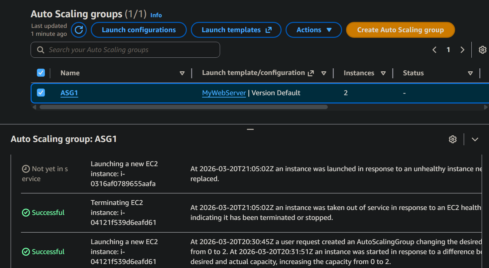
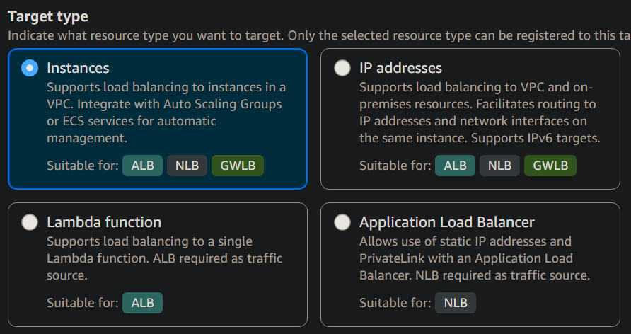

## Stateless vs Stateful

- **Stateless** — no stored session state; each request is independent  
  - No reliance on previous requests  
  - Examples: web servers, REST APIs, microservices  

- **Stateful** — maintains session or application state across requests  
  - Requests may depend on previous interactions  
  - Examples: databases, file systems, applications with session data (e.g., shopping carts)  
  - State is commonly managed using cookies, sessions, or tokens  

---

## Scaling Up vs Scaling Out

- **Scaling Up (Vertical Scaling)** — increasing resources of a single instance (CPU, RAM, storage)  
  - Limited by hardware capacity  
  - Can improve performance but reduces flexibility  

- **Scaling Out (Horizontal Scaling)** — adding more instances to distribute load  
  - Improves fault tolerance and availability  
  - More flexible and typically more cost-effective  
  - Enables use of Auto Scaling Groups (ASGs)  

**Rule of Thumb:**  
Stateless applications are easier to scale horizontally, while stateful applications traditionally rely more on vertical scaling. Modern architectures, however, often enable horizontal scaling for both depending on design.

---

## Key Takeaways

- Scaling out → high availability and fault tolerance  
- Scaling up → increased performance per instance  

---

## EC2 Auto Scaling Groups (ASGs)

ASGs automatically adjust the number of EC2 instances based on demand.

### Key Features

- Automatically launches and terminates instances  
  - Enables horizontal scaling (scale out/in)  

- Maintains desired capacity and availability  
  - Provides elasticity and resilience  

- Scales dynamically based on metrics  
  - e.g., CPU utilization, network traffic (via CloudWatch)  

- Integrates with multiple AWS services  
  - EC2, ECS, EKS  

---

## Common AWS Integrations

- **CloudWatch** → monitoring and scaling triggers  
- **Elastic Load Balancer (ELB)** → traffic distribution  
- **EC2 Spot Instances** → cost optimization  
- **VPC** → multi-AZ deployments  

---

## Launch Options

- **Launch Templates** — recommended modern approach  
  - Define AMI, instance type, networking, security groups, etc.  

- **Launch Configurations** — legacy  
  - Limited functionality and cannot be updated  
  - Replaced by Launch Templates  

---

## Health Checks

- **EC2 Status Checks** — instance-level status checks  
- **ELB Health Checks** — application-level health checks
  - automatically includes instance status checks

- **Health Check Grace Period**  
  - Time allowed for a new instance to initialize before health checks begin  
  - Prevents premature replacement of instances  

---

## Types of Auto Scaling

- **Manual Scaling** — manually adjust capacity
- **Dynamic Scaling** — automatically adjust based on demand
- **Predictive Scaling** — uses ML to predict future demand
- **Scheduled Scaling** — scale based on a schedule 

---

## HOL Lab Notes - User Data Web Server

- `yum` is used for Amazon Linux 2 but doesn't work for Amazon Linux 2023
- `dnf` is the package manager for Amazon Linux 2023
    - Scripts using both package managers are provided for compatibility with both versions of Amazon Linux.

- Ensure browser is HTTP enabled, HTTPS support requires additional configuration
    1. Apache listening on 443
    2. A TLS certificate + private key
    3. Security group rule allowing 443 

**Note:** most browsers automatically redirect HTTP to HTTPS meaning these scripts will fail to load on HTTPS if not manually adjusted. This is a common issue when using self-signed certificates or when the server is not configured for HTTPS.

Pictured below is what the `Activity History` of an ASG looks like when scaling out and in based on CloudWatch metrics.

In this example, manual termination led to a scale out event as the ASG replaced the terminated instance.

---

## High Availability vs Fault Tolerance

| High Availability | Fault Tolerance |
|---:|:---|
| Minimizes downtime | Near-zero downtime |
| Redundant components (failover-based) | Fully redundant components (active-active) |
| Usually asynchronous replication | Synchronous replication required |
| Recovery required (seconds to minutes) | No recovery needed |
| Possible small data loss (RPO > 0) | No data loss (RPO = 0) |
| Lower cost | Higher cost |
| Active-passive (failover) | Active-active |
| Example: Multi-AZ (RDS, ELB) | Example: Multi-region active-active |

---

## Note on Availability Zones (AZs)

Think of an AZ as a single data center.

If that data center goes down, all resources in that AZ are unavailable. 

By deploying across multiple AZs, you can achieve high availability and fault tolerance, ensuring your application remains accessible even if one AZ experiences issues.

---

## Durability vs Availability

| Durability | Availability |
|---|---|
| Protection against: | Measurement of: |
| • Data loss | • Uptime |
| • Data corruption | • % of time / year |
| • S3 offers 11 9's durability | • RDS Multi-AZ has 99.99% uptime |

- If you store 10 million objects in S3, you can expect to lose one object every 10,000 years on average 

---

## Elastic Load Balancing (ELB)

**ELB** automatically distributes incoming application traffic across multiple targets.

**Targets include:**
  - EC2 instances 
  - ECS containers
  - IP addresses
  - Lambda functions
  - Other Load Balancers

---

## Types of ELB

- **Classic Load Balancer (CLB)** – legacy
  - Supports basic Layer 4 and Layer 7
  - Not recommended for new applications
  - No advanced routing (no host/path-based routing)

- **Application Load Balancer (ALB)** – Layer 7 (HTTP/HTTPS)
  - Content-based, host-based, and path-based routing
  - Ideal for web apps and microservices
  - Supports instance, IP, and Lambda targets (containers via IP/instance)
  - Uses target groups with health checks

- **Network Load Balancer (NLB)** – Layer 4 (TCP/TLS/UDP)
  - High performance, ultra-low latency
  - Supports static / Elastic IP addresses
  - Supports instance, IP, and ALB targets
  - Supports TCP, TLS, and UDP
  - Supports weighted target groups 
    - e.g., blue/green, canary deployments

- **Gateway Load Balancer (GWLB)** – Layer 3 (network + appliance routing)
  - Designed for third-party virtual appliances (firewalls, IDS)
  - Uses GENEVE protocol
  - Transparent traffic inspection and forwarding
  - Supports instance and IP targets

---

## Key ELB Features
  - Uses target groups for routing
  - Performs health checks on targets
  - Routes traffic only to healthy targets
  - Supports multi-AZ deployments
  - Can be internet-facing or internal

---

## ELB Deployments

**Target Groups define:**
  - Target type (instance, IP, Lambda, etc.)
  - Target protocol and port
  - VPC and availability zones
  - Health check settings 
    - e.g., protocol, path, interval, thresholds
  - Registered targets 
    - e.g., EC2 instances, IPs, Lambda functions, etc.

**ELB Listeners define:**
  - Protocol and port
  - Routing rules
  - SSL/TLS certificate

**Network Mappings define:**
  - Availability zones
  - Subnets

ELBs deply nodes in each AZ (subnet) it is mapped to 

---

## Application Load Balancer (ALB) vs Network Load Balancer (NLB)

|Application Load Balancer (ALB)|Network Load Balancer (NLB)|
|---|---|
| Layer 7 (HTTP/HTTPS) | Layer 4 (TCP/UDP) |
|**Target type can be:** | **Target type can be:** |
| • Instance | • Instance |
| • IP | • IP |
| • Lambda | • ALB |
| Target group protocol must be HTTP/HTTPS | Target group protocol must be TCP/UDP |
| Health check protocol must be HTTP/HTTPS | Any health check protocol is supported |
| Can define rules for advanced routing | Can define elastic IP per subnet |

---

## ALB Advanced Routing

- **Host-based routing** — route based on hostname 
  - e.g., `api.example.com` vs `www.example.com`
- **Path-based routing** — route based on URL path 
  - e.g., `/api/*` vs `/images/*` 
- You can have multiple listeners on different ports 
  - e.g., 80 and 443
  - Only one listener, per port, per ALB
- Targets can be outside the VPC 
  - e.g., on-premises servers, other AWS accounts, etc.

---

## [What is the Source IP Address the App Sees?](https://aws.amazon.com/premiumsupport/knowledge-center/elb-capture-client-ip-addresses/)

| Load Balancer | Source IP Address | Preserved? |
|---|---|---|
| CLB & ALB | Private IP of ENI | Not preserved |
| NLB (UDP) | Original client IP | Preserved |
| **NLB (TCP/TLS):**| | |
| Instance ID | Original client IP | Preserved |
| IP Address | Private IP of ENI | Not preserved |

---

## Types of Dynamic Scaling

- **Target Tracking** - scale based on a specific metric target 
  - e.g., maintain 50% CPU utilization
  - not counted during warm-up period
  - AWS recommends a 1 minute frequency

- **Simple Scaling** - scale based on a single metric threshold 
  - e.g., scale out if CPU > 70% for 5 minutes
  - requires 300s cooldown period to prevent rapid scaling

- **Step Scaling** - scale based on multiple metric thresholds
  - e.g., scale out by 1 if CPU > 70%, scale out by 2 if CPU > 90%

- **Scheduled Scaling** - scale based on a schedule 
  - e.g., scale out at 8am, scale in at 6pm
  - useful for predictable traffic patterns 
    - e.g., business hours, lunch rush, etc.

---

## Cross-Zone Load Balancing

| Enabled when: | Disabled when: |
|---:|:---|
| Each ELB node → all targets in all AZs | Each ELB node → only to targets in its own AZ |
| Always enabled for ALB and CLB | Optional for NLB & GWLB (disabled by default) |

---

## Cross-Zone Load Balancing Example:

### Cross-zone load balancing **DISABLED**  
  **1 ELB node** in AZ1, **3 targets** in AZ1  
  **1 ELB node** in AZ2, **2 targets** in AZ2

**Traffic to ELB is distributed 50/50 between AZ1 and AZ2:**
  - **Results in AZ 1:** Each target receives 1/3 of AZ1 traffic  
    → *16.67%* of **total traffic** *per target*
  - **Results in AZ 2:** Each target receives 1/2 of AZ2 traffic  
    → *25%* of **total traffic** *per target*

---

### Cross-zone load balancing **ENABLED**  
  **1 ELB node** in AZ1, **3 targets** in AZ1  
  **1 ELB node** in AZ2, **2 targets** in AZ2

**Traffic to ELB is distributed 60/40 between AZ1 and AZ2:**
  - **Results in all targets:** Each target receives 1/5 of total traffic  
    → *20%* of **total traffic** *per target* in **all AZs**

---

## Session State Data (Sticky Sessions)

Session data such as authentication details can be stored and retried using:
  - DynamoDB Tables
  - ElastiCache (fast in-memory data store)
  - Usually want a key-value store for session data 
    - e.g., user ID → session data

**Sticky sessions** (session affinity) can be enabled on the ELB to route a user's requests to the same target 
  - Useful for stateful applications
    - Can lead to uneven load distribution and reduced fault tolerance

**Cookies** can be used to store session data on the client side for **cookie lifetime** or **application-controlled lifetime** 
  - e.g., until browser close
  - Less secure than server-side storage but can be useful for simple applications
  - Since data is stored **locally**, if session crashes, then session data is lost

---

## [Secure Sockets Layer (SSL) / Transport Layer Security (TLS)](https://drive.google.com/drive/folders/1fhLgTPllTvhq5RkJCbhdo1NmmnAqB4Md?usp=drive_link)

- **SSL** stands for **Secure Sockets Layer** and is the predecessor to **TLS**
- **TLS** stands for **Transport Layer Security** and is the modern, more secure protocol used for encrypting data in transit. 

- **ALB** can use **self-signed certificates**
  - Recommended for testing and development environments
  - Not recommended for production due to security risks

- **NLB** requires a certificate from **AWS Certificate Manager (ACM)**
  - Certificate must be in the same region as the NLB
  - ACM provides free public certificates for use with AWS services

---

## Quick References

### [ELB Use Cases](https://drive.google.com/drive/folders/1trzy3C57bU4lpfxE-VnznUMfi2meAa8b?usp=drive_link)

### [ASG & ELB Architecture Patterns Private Link](https://drive.google.com/drive/folders/1CAXbFCIvNFT3s__yGGmJK_xmFT69tDUU?usp=drive_link)

### [ASG & ELB Exam Cram](https://drive.google.com/drive/folders/1trzy3C57bU4lpfxE-VnznUMfi2meAa8b?usp=drive_link)

### [ASG & ELB Quiz](https://www.udemy.com/course/aws-certified-solutions-architect-associate-hands-on/learn/quiz/5346098#overview)

### [ASG & ELB Cheat Sheet](https://drive.google.com/drive/folders/1trzy3C57bU4lpfxE-VnznUMfi2meAa8b?usp=drive_link)

---