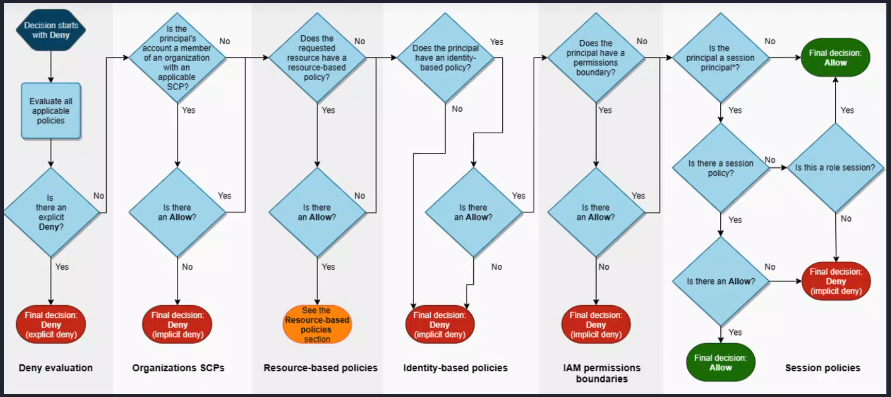
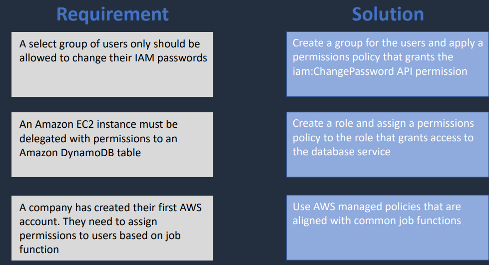
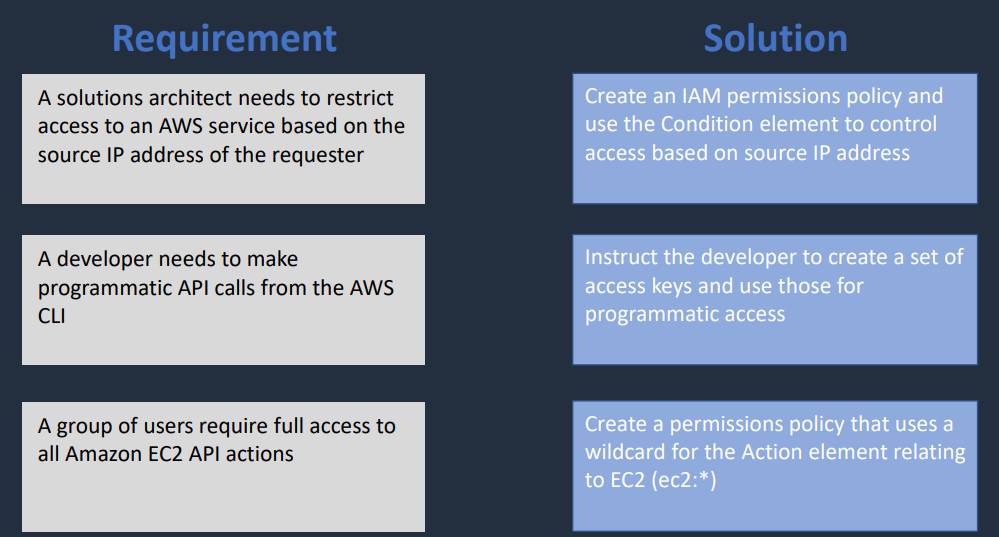

## IAM Principals & Authentication

An **IAM Principal** is a person or application that can make requests to AWS resources.

### Key Idea

* All IAM principals must be **authenticated** before making requests

### Authorization

AWS determines whether to allow or deny a request based on attached **policies**.

* Policies define permissions
* Can be attached to:

  * Users
  * Groups
  * Roles *(identity-based policies)*
* Can also be attached directly to resources *(resource-based policies)*

---

## Resource Identification (ARN)

Every AWS resource has:

* A **friendly name**
* A unique identifier called an **ARN (Amazon Resource Name)**

### ARN Format

```text
arn:partition:service:region:account-id:resource-type/resource-id
```

---

## IAM Groups

* IAM User Groups are collections of users
* Used to manage permissions for multiple users at once
* Policies attached to groups are inherited by all users

### Key Notes

* Users can belong to multiple groups
* Permissions are cumulative

**Example:**

* "Developers" group → access to dev resources
* "Admins" group → full access
  → A user in both inherits both permission sets

---

## Authentication Methods

IAM users can authenticate using:

* **Access Keys** → programmatic access (CLI, SDKs, APIs)
* **Passwords** → AWS Management Console
* **Multi-Factor Authentication (MFA)** → added security layer

---

## Login References

* **IAM User Login**
  https://ijpc-training.signin.aws.amazon.com/console<br>
  Username: `ijpc-training`

* **Root Account Login**
  https://console.aws.amazon.com/<br>
  Use the **root email option**

---

## Permissions Boundaries

A **permissions boundary** is a managed policy that sets the **maximum permissions** an IAM user or role can have.

### Key Points

* Can be applied to users or roles (not groups)
* Does NOT grant permissions
* Only limits what *can* be granted

### Effective Permissions

Final Permissions = Identity Policy ∩ Permissions Boundary

---

## Privilege Escalation

Occurs when a user or role gains more permissions than intended.

### Prevention

* Follow **least privilege**
* Regularly audit permissions
* Use **permissions boundaries**

### Rule

* Users can only create roles/permissions equal to or less than their own.

---

## Service Control Policies (SCPs)

SCPs are organization-level policies used in AWS Organizations.

### Purpose

* Set **permission guardrails** across accounts
* Enforce compliance and security

### Key Points

* Do NOT grant permissions
* Only restrict permissions

---

## SCP vs Permissions Boundary

* **SCP** → organization-wide limit
* **Permissions Boundary** → individual user/role limit

---

## Permission Evaluation Logic

### Order of Evaluation

1. **Explicit Deny (any policy)** → EXPLICIT DENY
2. **SCP check**

   * If no Allow → IMPLICIT DENY
3. **Resource-based policy**

   * No Allow → Move to next step
   * If Allow → check policy conditions
4. **Identity-based policy**

   * No Allow → IMPLICIT DENY
5. **Permissions Boundary**

   * No Allow → IMPLICIT DENY
6. **Session policies / role session**

   * Evaluated if applicable in order of Session Policy → Role Session
   * No Allow → IMPLICIT DENY
7. **Final Decision**

    * Allow if no denies exist, otherwise IMPLICIT DENY

<!---->
### [Permission Evaluation Flow Diagram Private Link](https://drive.google.com/file/d/1LYzD_6GxymOqRbOx-lpOu5pzNdUHtSic/view?usp=drive_link)

---

### Simplified Order

* Explicit Deny
* SCP Deny
* Resource-based Deny
* Identity-based Deny
* Permissions Boundary Deny
* Session Policy Deny
* Role Session Allow
* Allow

---

## Request Context

Requests are evaluated based on:

* Action (what is being done)
* Resource (what it's being done to)
* Principal (who is making the request)
* Environment data (IP, time, etc.)
* Resource data

---

## Roles vs Policies

* **Role**

  * An identity that can be assumed
  * Provides temporary credentials
  * Defines permissions when assumed

* **Policy**

  * A document that defines permissions
  * Attached to identities or resources

### Summary

* Role = identity
* Policy = permission definition

---

## Types of Policies

* Identity-based policies
* Resource-based policies
* Permissions boundaries
* Service Control Policies (SCPs)
* Session policies

---

## Permission Rules

* Default = **implicit deny**
* Explicit allow overrides implicit deny
* Explicit deny overrides everything
* SCPs, boundaries, and session policies can restrict permissions

---

## Analogy

* Identity-based policy → ID badge
* Permissions boundary → security guard
* Resource-based policy → room access list
* SCP → company-wide rules

---

## Logic Model

* Allow = Union (OR)
* Deny = Intersection (AND)

---

## AWS Requests

* Every action in AWS is an **API call**
* Defined as:

```
Action: service:operation
```

---

## IAM Policies (Structure)

IAM policies are JSON documents with:

* **Effect** → Allow / Deny
* **Action** → what is allowed/denied
* **Resource** → what it applies to
* **Condition** → optional constraints

---

## IAM Tools

### Policy Simulator

* Test permissions without switching users

### Access Analyzer

* Identifies excessive or risky access
* Helps generate least-privilege policies

---

## Security Token Service (STS)

* Provides **temporary credentials**
* Used for:

  * Federated access
  * Cross-account access
  * Applications

---

## [AWS IAM Best Practices](https://docs.aws.amazon.com/IAM/latest/UserGuide/best-practices.html)

* Use federation for human users
* Use roles + temporary credentials for workloads
* Require MFA
* Rotate access keys
* Protect root credentials
* Apply least privilege
* Start with managed policies → refine
* Use Access Analyzer
* Remove unused identities and permissions
* Use policy conditions
* Validate policies regularly
* Use Organizations + Control Tower for guardrails
* Use permissions boundaries for delegation

---

## [Exam Cram](https://www.udemy.com/course/aws-certified-solutions-architect-associate-hands-on/learn/lecture/28616888#overview) 

* CLI = command-line interface for AWS
* IAM users represented by applications are known as **service accounts**
* 5000 user limit per account
* Groups manage multiple users
* Roles are assumed identities with temporary credentials
* Policies are JSON documents that define permissions
* Permissions boundaries limit maximum permissions
* SCPs set organization-wide permission limits
* Explicit deny overrides everything
* Requests evaluated in order: Explicit Deny → SCP → Resource-based → Identity-based → Permissions Boundary → Session Policies → Role Session → Allow

---

## Architecture Patterns - IAM

<!-- These Images references have been left here as an artifact for the versioning of this document, but the actual images have been removed from the repository and replaced with private links to the new location of the original materials. 


 -->

### [IAM Architecture Patterns1 Private Link](https://drive.google.com/file/d/1t31KkZIopALSoLC59CwS3N-g1p79P37W/view?usp=drive_link) <br>
### [IAM Architecture Patterns2 Private Link](https://drive.google.com/file/d/1cjYVNKm53xOCQptiZO-rwI1jLw8JeI5i/view?usp=drive_link)

---

## Reference

### [IAM Quiz](https://www.udemy.com/course/aws-certified-solutions-architect-associate-hands-on/learn/quiz/5346094#overview)
### [IAM Cheat Sheet](https://digitalcloud.training/aws-iam/)

---
