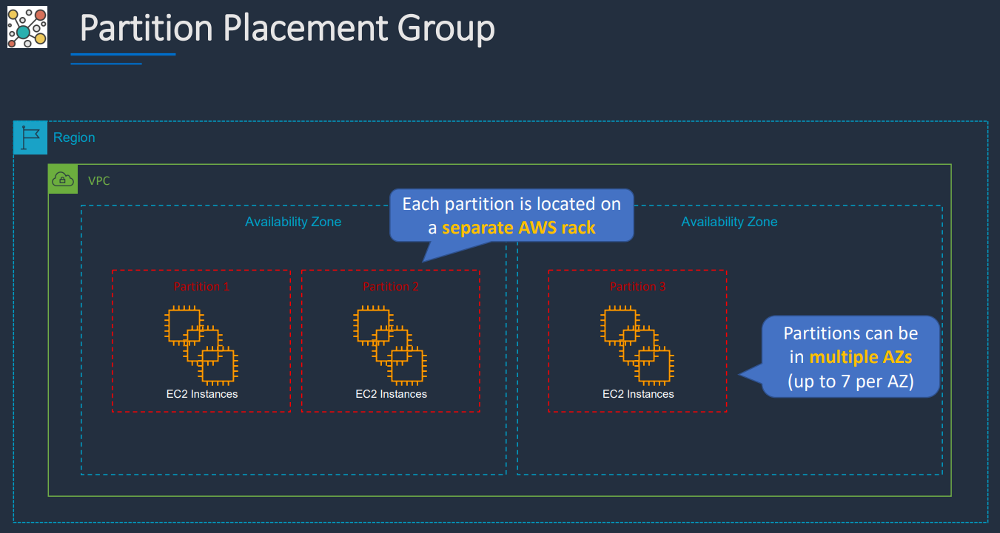
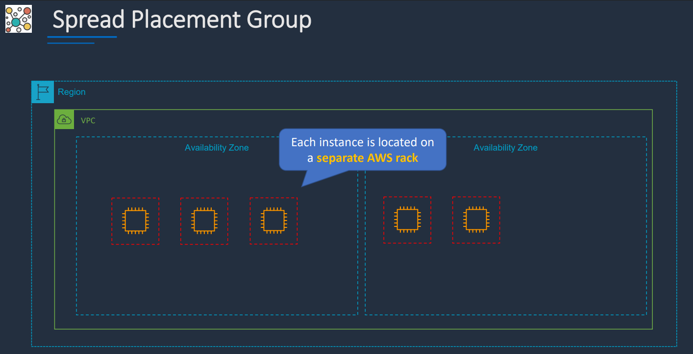

## Amazon EC2 (Elastic Compute Cloud)

Amazon EC2 provides **virtual servers in AWS data centers**.

### Key Points
- EC2 instances are virtual machines running in the cloud
- Instances connect to the network through **Elastic Network Interfaces (ENIs)**
- Instances are launched inside a **VPC (Virtual Private Cloud)**
- They can be placed in either:
  - **Public subnets** → have a route to the internet through an **Internet Gateway (IGW)**
  - **Private subnets** → do not have a direct internet route, but can access the internet through a **NAT Gateway** in a public subnet
- **EBS (Elastic Block Store)** provides persistent block storage for instances

### Customer Responsibility
Everything inside the instance is managed by the customer, including:
- Operating system
- Installed software
- Security patches
- Application configuration

### Flexibility
- Instances can be:
  - Resized
  - Stopped
  - Started
  - Terminated

### Pricing Notes
- Cost depends on:
  - Instance type
  - Runtime hours
  - Attached storage
  - Data transfer
- **Inbound data transfer** is generally free
- **Outbound data transfer** is charged
- Data transfer between instances in same Availability Zone is free, but between different AZs or regions may incur charges

---

## EC2 Instance Types

Different instance families are optimized for different workloads.

### Categories
- **General Purpose** → balanced compute, memory, and networking  
  Examples: `t3`, `m5`
- **Compute Optimized** → high CPU performance  
  Example: `c5`
- **Memory Optimized** → high memory performance  
  Example: `r5`
- **Storage Optimized** → high storage throughput  
  Example: `i3`
- **Accelerated Computing** → GPU or other hardware accelerators  
  Example: `p3`

### Example: `m5.large`
- `m` = family
- `5` = generation
- `large` = size

> Note: `m` stands for **general purpose**, not memory optimized.

---

## Elastic Network Interfaces (ENIs)

An **ENI** is the network interface attached to an EC2 instance.

### Key Points
- Instances in a **public subnet** typically have:
  - Private IP
  - Public IP
- Instances in a **private subnet** typically have:
  - Private IP only
- ENIs can be attached and detached from EC2 instances
- ENIs can have **security groups** attached
- ENIs must belong to the **same VPC** as the instance

---

## Public IP Address

A public IP allows an EC2 instance in a public subnet to communicate with the internet.

### Key Points
- Used for internet communication
- Associated with the instance’s private IP
- Released when the instance is stopped or terminated
- Cannot be moved to another instance or ENI

---

## Private IP Address

A private IP is used for internal communication within the VPC.

### Key Points
- Used in both public and private subnets
- Remains associated with the instance while it exists
- Used for internal VPC communication

---

## Elastic IP Address (EIP)

An **Elastic IP** is a static public IP address.

### Key Points
- Can be associated with an EC2 instance or ENI
- Can be moved between instances or ENIs in the same region
- Useful when you need a stable public IP
- Charged when allocated but not attached to a running instance

### Summary
- **Public IP** → temporary public address
- **Private IP** → internal address
- **Elastic IP** → static public address that can be reassigned

---

## ENI vs ENA vs EFA

### ENI (Elastic Network Interface)
- Standard network interface for EC2
- Works with normal instance networking

### ENA (Elastic Network Adapter)
- Enhanced networking option
- Provides higher bandwidth and lower latency
- Requires supported instance types

### EFA (Elastic Fabric Adapter)
- Designed for **high-performance computing (HPC)** and tightly coupled workloads
- Useful for:
  - MPI workloads
  - Scientific computing
  - Machine learning clusters
- Only supported in certain instance types, regions, and Availability Zones

### MPI
**MPI (Message Passing Interface)** is a standardized method for processes to communicate in parallel/distributed systems.

---

## EBS Volumes

EBS volumes appear as local drives on the instance, but they are actually **network-attached storage**.

### Key Points
- Must be in the **same Availability Zone** as the EC2 instance
- Can be detached and reattached to another instance in the same AZ
- Persist independently of the instance unless deleted
- Pricing depends on:
  - Volume type
  - Provisioned size
  - Performance characteristics

### Common EBS Types
- `gp3` → general purpose, cost-effective, default for most workloads
- `gp2` → older general-purpose generation
- `io2` → high performance, critical workloads
- `io1` → older provisioned IOPS type
- `st1` → throughput optimized, big data / logs
- `sc1` → cold HDD, infrequent access
- `magnetic` → older generation, not recommended for new use

---

## Ephemeral Storage (Instance Store)

Instance store volumes provide **temporary storage physically attached to the host server**.

### Key Points
- Non-persistent storage
- Data is lost when the instance stops, terminates, or the host fails
- Useful for:
  - Buffers
  - Caches
  - Scratch data
  - Temporary content

---

## Launching an Instance

### Basic Steps
1. Choose an **instance type**
   - Defines hardware profile and cost
2. Choose an **AMI (Amazon Machine Image)**
   - Defines operating system and software setup

### AMIs
- Backed by **snapshots**
- Snapshots are point-in-time copies of EBS volumes
- Can be used to create new AMIs or restore systems

---

## HOL Lab Notes

### SSH Access
You can find the SSH command in the EC2 console under the **Connect** section.

Example:

```bash
ssh -i /path/to/my-key.pem ec2-user@<public-ip-address>
```

## Connection Types

- **Public IP**
  - Used for instances in public subnets
  - Allows direct access from the internet

- **Private IP**
  - Used for instances in private subnets
  - Requires VPN, Direct Connect, or bastion host access

---

## Useful Commands (Conceptual)

From the instance shell, common commands include:

```bash
ls            # list files
ifconfig      # check network configuration
ping google.com  # verify connectivity
```

AWS CLI can be used to:
- Start, stop, terminate instances
- Manage EBS volumes
- Manage ENIs

---

## Cost Reminder

- Terminate instances when finished
- Delete unused EBS volumes
- Avoid leaving idle resources running

---

## Instance Metadata

Instance metadata is accessible **from inside the instance only**.

### Common Metadata Queries

```bash
http://169.254.169.254/latest/meta-data/ # instance metadata base URL
/local-ipv4     # private IP
/public-ipv4    # public IP
```

---

## IMDSv1 vs IMDSv2

The **Instance Metadata Service (IMDS)** provides instance information.

### IMDSv1
- Original version
- Simpler
- Less secure

### IMDSv2
- More secure
- Requires session tokens
- Recommended for production use

### Note
Some environments still use IMDSv1, but IMDSv2 should be preferred.

---

## EC2 User Data

User data is code executed when an instance launches for the first time.

### Key Points
- Used to automate configuration
- Runs with root privileges
- Executes only on first launch by default
- Limited to 16 KB (before encoding)

### Common Uses
- Install packages
- Configure services
- Run initialization scripts

### Notes
- Automatically base64 encoded when using AWS CLI
- Does not rerun on stop/start unless explicitly configured

---

## Common Ports

- **Port 22 (SSH)** → remote access
- **Port 80 (HTTP)** → web traffic
- **Port 443 (HTTPS)** → secure web traffic

These must be allowed in the **security group**.

---

## IMDS Usage (Conceptual Flow)

### IMDSv1

## Example commmands to run:

1. Get the instance ID:
`curl http://169.254.169.254/latest/meta-data/instance-id`

2. Get the AMI ID:
`curl http://169.254.169.254/latest/meta-data/ami-id`

3. Get the instance type:
`curl http://169.254.169.254/latest/meta-data/instance-type`

4. Get the local IPv4 address:
`curl http://169.254.169.254/latest/meta-data/local-ipv4`

5. Get the public IPv4 address:
`curl http://169.254.169.254/latest/meta-data/public-ipv4`

6. Can get the list of queries availiable in any category by ending with a '/':
`curl http://169.254.169.254/latest/meta-data/`

### IMDSv2

## Step 1 - Create a session and get a token

`TOKEN=$(curl -X PUT "http://169.254.169.254/latest/api/token" -H "X-aws-ec2-metadata-token-ttl-seconds: 21600")`

## Step 2 - Use the token to request metadata

1. Get the instance ID:
`curl -H "X-aws-ec2-metadata-token: $TOKEN" http://169.254.169.254/latest/meta-data/instance-id`

2. Get the AMI ID:
`curl -H "X-aws-ec2-metadata-token: $TOKEN" http://169.254.169.254/latest/meta-data/ami-id`

## Use metadata with user data to configure the instance
'bash.sh' file in code directory contains a simple HTML code to display instance metadata on a webpage. It uses IMDSv2 to fetch metadata and then creates an HTML page to display it. 

## Practical Use Cases

Metadata + user data can be combined to:

- Configure instances dynamically at launch
- Display instance info (e.g., in web apps)
- Automate tagging or configuration logic
- Customize behavior based on environment

---

## Access Keys 

- **Access Keys** are long term credentials for programmatic access
  - Less secure than temporary credentials, best to rotate regularly
  - Should be stored securely and not hardcoded in applications
  - Saved as plain text in the AWS console, so must be copied immediately
- **Secret Access Keys** are the secret part of the access key pair
  - Must be kept confidential
  - Should never be shared or exposed
  - Grant same permissions as the access key
- **IAM Roles** are better as they provide temporary credentials

```bash
aws configure # prompts for access key, secret key, region, and output format
aws s3 ls     # example command to list S3 buckets using configured credentials
aws s3 mb s3://my-bucket # example command to create an S3 bucket using configured credentials
cat config      # view the contents of the AWS config file
cat credentials # view the contents of the AWS credentials file
```

**Very Important:** If credenials file is not remmoved, both access keys will be visible in plain text, which is a security risk. Always remove or secure the credentials file after use.

If you deactivate and then delete the access key, it will no longer be usable. 
  - *Deactivating* allows you to temporarily disable the key 
  - *Deleting* allows you to permanently removes it from your account

---

## Status Checks

EC2 instances have two types of status checks:
1. **System Status Check** → checks the underlying hardware and network <br>
    (AWS-managed)
2. **Instance Status Check** → checks the software and configuration of the instance <br> 
    (customer-managed)

Users can view and create alarms based on these status checks to monitor instance health and receive notifications of issues.

---

## Monitoring

EC2 instances can be monitored using **CloudWatch** for:
  - CPU utilization 
  - Disk I/O
  - Network traffic
  - Status check failures
  - Custom application metrics

***CloudWatch Alarms*** can be set up to trigger notifications or automated actions based on specific thresholds.

---

## EC2 Placement Groups

- **Cluster** - groups instances close together in the same AZ for low latency and high throughput
  - Typically used for toughtly coupled, HPC and big data workloads


- **Partition** - spreads instances across logical partitions to reduce failure risk
  - Do not share the underlying hardware within a partition
  - Typically used for large distributed & replicated workloads 
  - e.g. Hadoop, Cassandra, Kafka and HDFS



- **Spread** - strictly places a small group of instances
  - On distinct underlying hardware to reduce correlated failures



**Some Use Cases:**


---
