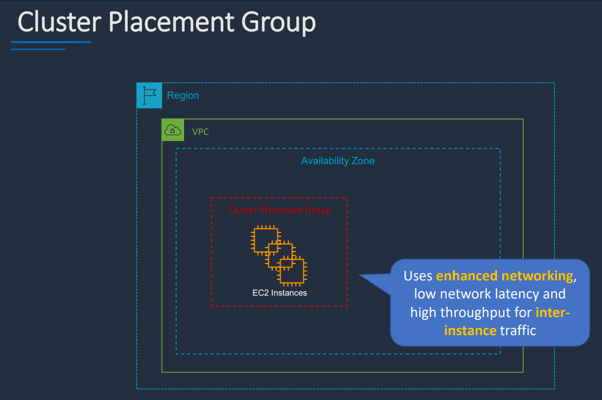
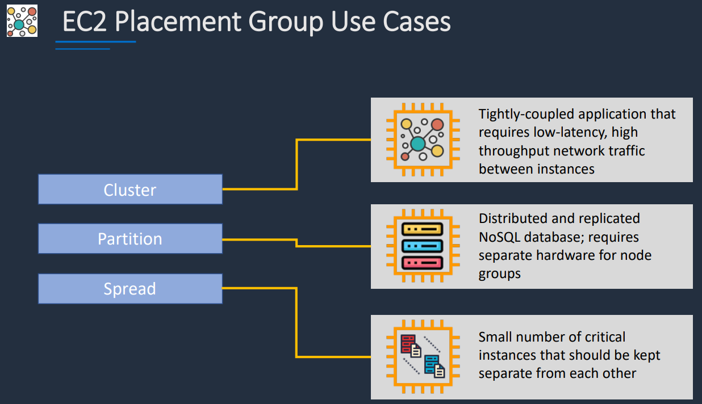
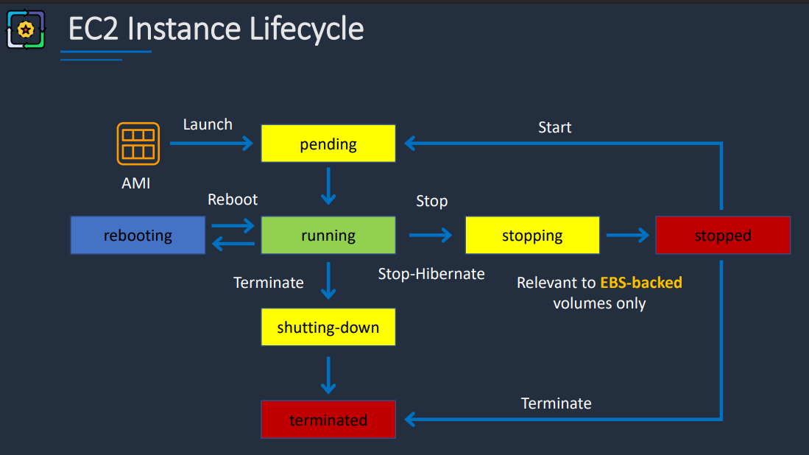
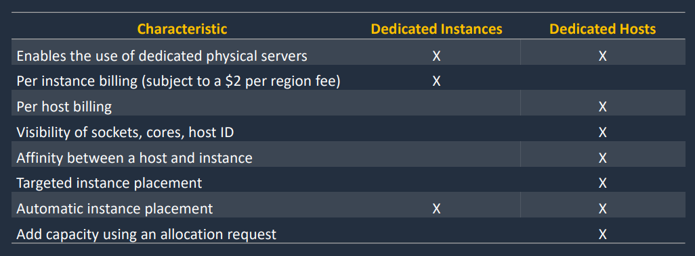
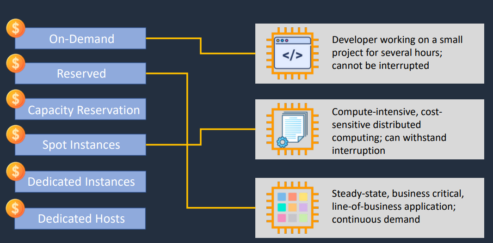
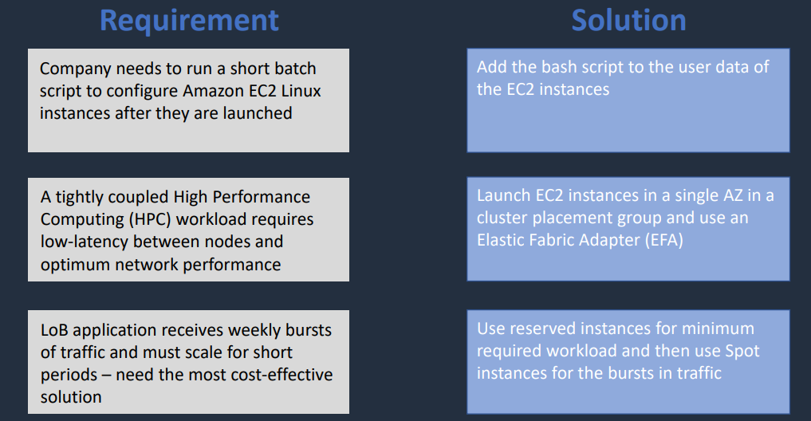
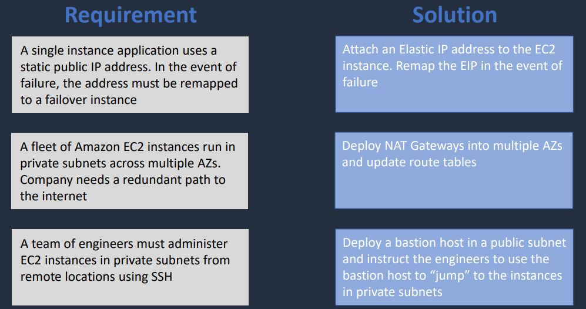
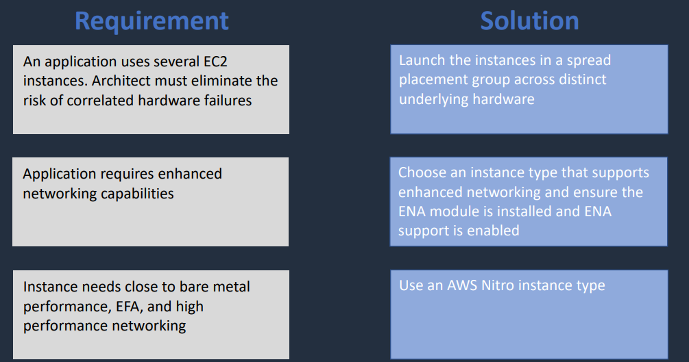

## Amazon EC2 (Elastic Compute Cloud)

Amazon EC2 provides **virtual servers in AWS data centers**.

### Key Points
- EC2 instances are virtual machines running in the cloud
- Instances connect to the network through **Elastic Network Interfaces (ENIs)**
- Instances are launched inside a **VPC (Virtual Private Cloud)**
- They can be placed in either:
  - **Public subnets** → have a route to the internet through an **Internet Gateway (IGW)**
  - **Private subnets** → do not have a direct internet route, but can access the internet through a **NAT Gateway** in a public subnet
- **EBS (Elastic Block Store)** provides persistent block storage for instances

### Customer Responsibility
Everything inside the instance is managed by the customer, including:
- Operating system
- Installed software
- Security patches
- Application configuration

### Flexibility
- Instances can be:
  - Resized
  - Stopped
  - Started
  - Terminated

### Pricing Notes
- Cost depends on:
  - Instance type
  - Runtime hours
  - Attached storage
  - Data transfer
- **Inbound data transfer** is generally free
- **Outbound data transfer** is charged
- Data transfer between instances in same Availability Zone is free, but between different AZs or regions may incur charges

---

## EC2 Instance Types

Different instance families are optimized for different workloads.

### Categories
- **General Purpose** → balanced compute, memory, and networking  
  Examples: `t3`, `m5`
- **Compute Optimized** → high CPU performance  
  Example: `c5`
- **Memory Optimized** → high memory performance  
  Example: `r5`
- **Storage Optimized** → high storage throughput  
  Example: `i3`
- **Accelerated Computing** → GPU or other hardware accelerators  
  Example: `p3`

### Example: `m5.large`
- `m` = family
- `5` = generation
- `large` = size

> Note: `m` stands for **general purpose**, not memory optimized.

---

## Elastic Network Interfaces (ENIs)

An **ENI** is the network interface attached to an EC2 instance.

### Key Points
- Instances in a **public subnet** typically have:
  - Private IP
  - Public IP
- Instances in a **private subnet** typically have:
  - Private IP only
- ENIs can be attached and detached from EC2 instances
- ENIs can have **security groups** attached
- ENIs must belong to the **same VPC** as the instance

---

## Public IP Address

A public IP allows an EC2 instance in a public subnet to communicate with the internet.

### Key Points
- Used for internet communication
- Associated with the instance’s private IP
- Released when the instance is stopped or terminated
- Cannot be moved to another instance or ENI

---

## Private IP Address

A private IP is used for internal communication within the VPC.

### Key Points
- Used in both public and private subnets
- Remains associated with the instance while it exists
- Used for internal VPC communication

---

## Elastic IP Address (EIP)

An **Elastic IP** is a static public IP address.

### Key Points
- Can be associated with an EC2 instance or ENI
- Can be moved between instances or ENIs in the same region
- Useful when you need a stable public IP
- Charged when allocated but not attached to a running instance

### Summary
- **Public IP** → temporary public address
- **Private IP** → internal address
- **Elastic IP** → static public address that can be reassigned

---

## ENI vs ENA vs EFA

### ENI (Elastic Network Interface)
- Standard network interface for EC2
- Works with normal instance networking

### ENA (Elastic Network Adapter)
- Enhanced networking option
- Provides higher bandwidth and lower latency
- Requires supported instance types

### EFA (Elastic Fabric Adapter)
- Designed for **high-performance computing (HPC)** and tightly coupled workloads
- Useful for:
  - MPI workloads
  - Scientific computing
  - Machine learning clusters
- Only supported in certain instance types, regions, and Availability Zones

### MPI
**MPI (Message Passing Interface)** is a standardized method for processes to communicate in parallel/distributed systems.

---

## EBS Volumes

EBS volumes appear as local drives on the instance, but they are actually **network-attached storage**.

### Key Points
- Must be in the **same Availability Zone** as the EC2 instance
- Can be detached and reattached to another instance in the same AZ
- Persist independently of the instance unless deleted
- Pricing depends on:
  - Volume type
  - Provisioned size
  - Performance characteristics

### Common EBS Types
- `gp3` → general purpose, cost-effective, default for most workloads
- `gp2` → older general-purpose generation
- `io2` → high performance, critical workloads
- `io1` → older provisioned IOPS type
- `st1` → throughput optimized, big data / logs
- `sc1` → cold HDD, infrequent access
- `magnetic` → older generation, not recommended for new use

---

## Ephemeral Storage (Instance Store)

Instance store volumes provide **temporary storage physically attached to the host server**.

### Key Points
- Non-persistent storage
- Data is lost when the instance stops, terminates, or the host fails
- Useful for:
  - Buffers
  - Caches
  - Scratch data
  - Temporary content

---

## Launching an Instance

### Basic Steps
1. Choose an **instance type**
   - Defines hardware profile and cost
2. Choose an **AMI (Amazon Machine Image)**
   - Defines operating system and software setup

### AMIs
- Backed by **snapshots**
- Snapshots are point-in-time copies of EBS volumes
- Can be used to create new AMIs or restore systems

---

## HOL Lab Notes

### SSH Access
You can find the SSH command in the EC2 console under the **Connect** section.

Example:

```bash
ssh -i /path/to/my-key.pem ec2-user@<public-ip-address>
```

## Connection Types

- **Public IP**
  - Used for instances in public subnets
  - Allows direct access from the internet

- **Private IP**
  - Used for instances in private subnets
  - Requires VPN, Direct Connect, or bastion host access

---

## Useful Commands (Conceptual)

From the instance shell, common commands include:

```bash
ls            # list files
ifconfig      # check network configuration
ping google.com  # verify connectivity
```

AWS CLI can be used to:
- Start, stop, terminate instances
- Manage EBS volumes
- Manage ENIs

---

## Cost Reminder

- Terminate instances when finished
- Delete unused EBS volumes
- Avoid leaving idle resources running

---

## Instance Metadata

Instance metadata is accessible **from inside the instance only**.

### Common Metadata Queries

```bash
http://169.254.169.254/latest/meta-data/ # instance metadata base URL
/local-ipv4     # private IP
/public-ipv4    # public IP
```

---

## IMDSv1 vs IMDSv2

The **Instance Metadata Service (IMDS)** provides instance information.

### IMDSv1
- Original version
- Simpler
- Less secure

### IMDSv2
- More secure
- Requires session tokens
- Recommended for production use

### Note
Some environments still use IMDSv1, but IMDSv2 should be preferred.

---

## EC2 User Data

User data is code executed when an instance launches for the first time.

### Key Points
- Used to automate configuration
- Runs with root privileges
- Executes only on first launch by default
- Limited to 16 KB (before encoding)

### Common Uses
- Install packages
- Configure services
- Run initialization scripts

### Notes
- Automatically base64 encoded when using AWS CLI
- Does not rerun on stop/start unless explicitly configured

---

## Common Ports

- **Port 22 (SSH)** → remote access
- **Port 80 (HTTP)** → web traffic
- **Port 443 (HTTPS)** → secure web traffic

These must be allowed in the **security group**.

---

## IMDS Usage (Conceptual Flow)

### IMDSv1

## Example commmands to run:

1. Get the instance ID: <br>
`curl http://169.254.169.254/latest/meta-data/instance-id`

2. Get the AMI ID: <br>
`curl http://169.254.169.254/latest/meta-data/ami-id`

3. Get the instance type: <br>
`curl http://169.254.169.254/latest/meta-data/instance-type`

4. Get the local IPv4 address: <br>
`curl http://169.254.169.254/latest/meta-data/local-ipv4`

5. Get the public IPv4 address: <br>
`curl http://169.254.169.254/latest/meta-data/public-ipv4`

6. Can get the list of queries availiable in any category by ending with a '/': <br>
`curl http://169.254.169.254/latest/meta-data/`

### IMDSv2

## Step 1 - Create a session and get a token

`TOKEN=$(curl -X PUT "http://169.254.169.254/latest/api/token" -H "X-aws-ec2-metadata-token-ttl-seconds: 21600")`

## Step 2 - Use the token to request metadata

1. Get the instance ID: <br>
`curl -H "X-aws-ec2-metadata-token: $TOKEN" http://169.254.169.254/latest/meta-data/instance-id`

2. Get the AMI ID: <br>
`curl -H "X-aws-ec2-metadata-token: $TOKEN" http://169.254.169.254/latest/meta-data/ami-id`

## Use metadata with user data to configure the instance
'bash.sh' file in code directory contains a simple HTML code to display instance metadata on a webpage. It uses IMDSv2 to fetch metadata and then creates an HTML page to display it. 

## Practical Use Cases

Metadata + user data can be combined to:

- Configure instances dynamically at launch
- Display instance info (e.g., in web apps)
- Automate tagging or configuration logic
- Customize behavior based on environment

---

## Access Keys 

- **Access Keys** are long term credentials for programmatic access
  - Less secure than temporary credentials, best to rotate regularly
  - Should be stored securely and not hardcoded in applications
  - Saved as plain text in the AWS console, so must be copied immediately
- **Secret Access Keys** are the secret part of the access key pair
  - Must be kept confidential
  - Should never be shared or exposed
  - Grant same permissions as the access key
- **IAM Roles** are better as they provide temporary credentials

```bash
aws configure # prompts for access key, secret key, region, and output format
aws s3 ls     # example command to list S3 buckets using configured credentials
aws s3 mb s3://my-bucket # example command to create an S3 bucket using configured credentials
cat config      # view the contents of the AWS config file
cat credentials # view the contents of the AWS credentials file
```

**Very Important:** If credenials file is not remmoved, both access keys will be visible in plain text, which is a security risk. Always remove or secure the credentials file after use.

If you deactivate and then delete the access key, it will no longer be usable. 
  - *Deactivating* allows you to temporarily disable the key 
  - *Deleting* allows you to permanently removes it from your account

---

## Status Checks

EC2 instances have two types of status checks:
1. **System Status Check** → checks the underlying hardware and network <br>
    (AWS-managed)
2. **Instance Status Check** → checks the software and configuration of the instance <br> 
    (customer-managed)

Users can view and create alarms based on these status checks to monitor instance health and receive notifications of issues.

---

## Monitoring

EC2 instances can be monitored using **CloudWatch** for:
  - CPU utilization 
  - Disk I/O
  - Network traffic
  - Status check failures
  - Custom application metrics

***CloudWatch Alarms*** can be set up to trigger notifications or automated actions based on specific thresholds.

---

## EC2 Placement Groups

- **Cluster** - groups instances close together in the same AZ for low latency and high throughput
  - Typically used for toughtly coupled, HPC and big data workloads

<!---->
### [Cluster Diagram Private Link](https://drive.google.com/file/d/13pclSgdSyeQuh7A1lfk4lBaor05_JJSX/view?usp=drive_link)

- **Partition** - spreads instances across logical partitions to reduce failure risk
  - Do not share the underlying hardware within a partition
  - Typically used for large distributed & replicated workloads 
  - e.g. Hadoop, Cassandra, Kafka and HDFS

<!---->
### [Partition Diagram Private Link](https://drive.google.com/file/d/11Az7_CfuMm99vqNDVFN7YCfIDdr5TsA2/view?usp=drive_link)

- **Spread** - strictly places a small group of instances
  - On distinct underlying hardware to reduce correlated failures

<!---->
### [Spread Diagram Private Link](https://drive.google.com/file/d/1d-CwcIxBAETaNxRJPr-mGWwT-DS318Ip/view?usp=drive_link)

---

## Example Use Cases for Placement Groups

<!---->
### [Use Cases Diagram Private Link](https://drive.google.com/file/d/18rTDsqjTVEbv2yrtrEyWuSMFpdIIrbY8/view?usp=drive_link)

---

## Network Interfaces

- **Primary ENI** is created by default when an instance is launched 
  - Private IP by default, optional public IP if in a public subnet
- **Secondary ENIs** can be attached to an instance for additional network interfaces
  - Can have their own private IPs and security groups
  - Must be within the same VPC and AZ as the instance
- ENIs can be detached and reattached to other instances in the same AZ
  - Cannot be moved or attached across AZs or VPCs

---

## Types of Networked Applications

### ENI (Elastic Network Interface)
- Basic network interface for EC2
- Can be used with any instance type

### ENA (Elastic Network Adapter)
- Enhanced networking performance
- Higher bandwidth and lower inter-instance latency
- Requires supported instance types and AMIs

### EFA (Elastic Fabric Adapter)
- Designed for HPC, MPI and ML
- Tighly coupled applications
- Can use with all instance types

---

## IP Addressing

- **Public IP** → temporary public dynamic address for the instance
  - Released when stopped or terminated
  - Cannot be moved to another instance or ENI (e.g. us-east-1a to us-east-1b)
  - Charged when attached to a running instance

- **Private IP** → internal static address for VPC communication 
  - Remains associated with the instance while it exists
  - Used in both public and private subnets
  - Free of charge

- **Elastic IP** → static public address 
  - Remains associated even if the instance is stopped or terminated
  - Can be moved between instances or ENIs (in the same region)
  - Cannot be attached to multiple instances or ENIs at the same time
  - Charged when allocated but not attached to a running instance

This is why DNS is often used to abstract away IP changes
  - Especially for public facing applications

---

## NAT (Network Address Translation)

- **NAT Gateway** is a managed service that allows instances in private subnets to access the internet
  - Provides high availability and scalability
  - Charged based on usage and data transfer

* Can use `ipconfig` or `ifconfig` to check for `igw` (Internet Gateway) or `nat` (NAT Gateway) in the routing table to determine if the instance is in a public or private subnet.

---

## Private Subnets and Bastion Hosts

- First entry in route table is for local VPC communication
- If the 2nd entry is a route to an IGW, the instance is in a public subnet
- Otherwise, if there is no route or a route to a NAT Gateway, the instance is in a private subnet

## Bastion / Jump Host
- A special instance in a public subnet used to securely access instances in private subnets
- Acts as a gateway for SSH or RDP access to private instances
  - Allows secure access without direct internext access to private instances

---

## HOL Lab Notes - Bastion Host

Command line to connect to a public instance to a private instance through a bastion host:

```bash
nano <key-file.pem>   # open the private key file in a text editor
ssh -i <key-file.pem> ec2-user@<bastion-private-ip> # connect to the bastion host
ping google.com       # verify internet access from private instance fails
```

---

## NAT Gateways

- Created in the public subnet 
- NAT Gateway ID must be in the specified Private subnet RT (route table)
- Fully managed by AWS, highly available, and scalable
- No Security Groups (Instances require them)
- No SSH access 
- No  support for port forwarding or inbound connections

---

## NAT Instances

- EC2 insance pre-configured to perform NAT functions
- use `amzn-ami-vpc-nat` AMI from **AWS Marketplace**
- Must disable source/destination checks on the instance
- Less scalable and less available than NAT Gateway
- Can be used for cost savings in low traffic scenarios
- Requires manual management and maintenance 
  * (e.g., patching, monitoring, failover)
- Can be used as Bastion Host
  * if configured properly with security groups and routing
- Less common and secure than NAT Gateway
- Can implement port forwarding and support inbound connections

---

## HOL Lab Notes - NAT Gateway

1. Create a NAT Gateway in the public subnet
2. Go to *Route Tables* and select the route table associated with the private subnet
3. Edit routes and add a new route:
   - Destination: `0.0.0.0/0`
   - Target: `<NAT Gateway ID>`
4. Save the route and test connectivity from the private instance to the internet
   - `ping google.com` should succeed from the private instance
   - *Reminder*: Kill the command with `Ctrl + C` after verifying connectivity

You are charged for the NAT Gateway based on usage and data transfer. Always remember to delete the NAT Gateway when finished to avoid unnecessary costs.

---

## EC2 Lifecycle states:
- **Pending** → instance is being launched
- **Running** → instance is active and can be accessed
- **Rebooting** → instance is restarting
- **Stopping** → instance is being stopped
- **Stopped** → instance is stopped and can be restarted 
- **Shutting down** → instance is being terminated
- **Terminated** → instance is permanently deleted and cannot be restarted

<!---->
### [EC2 Lifecycle Private Link](https://drive.google.com/file/d/19YNMOOoC6z_GHbI1An7X5gQpWqvEr-Im/view?usp=drive_link)

---

## EC2 States In Detail

### Stopping EC2 Instances

  - EBS Backed instances only
  - No charge for stopped instances
  - EBS volumes remain attached
    - Charged based on provisioned size and type
  - Data in RAM is lost
  - Public IP is released (if not using an Elastic IP)
  - Private IP remains associated with the instance

### Hibernating EC2 Instances

  - Applies to suported instance types and AMIs
  - Saves the contents of RAM to the EBS root volume
  - Must be enabled at launch time
  - Specific prerequisites and limitations apply
  - Charges apply for EBS storage used to save the RAM contents

### Rebooting EC2 Instances

  - Equivalent to rebooting an OS reboot
  - DNS and IP addresses remain the same
  - No charge for rebooting

### Retiring EC2 Instances

  - AWS may retire an instance due to underlying hardware issues
  - AWS will notify customers in advance
  - Customers can choose to stop, start, or terminate the instance before the retirement date
    - If no action is taken, AWS will automatically stop the instance at the retirement time

### Terminating EC2 Instances

  - Means permanently deleting the instance
  - Cannot be restarted or recovered
  - EBS volumes with `Delete on Termination` set to true will be deleted
    - Otherwise they will persist and be charged

### Recovering EC2 Instances

  - CloudWatch can be used to monitor instance status and trigger recovery actions
  - Applies if instance fails a system status check
  - AWS will attempt to recover the instance on new hardware
    - Instance is identical to the original

---

## AWS Nitro System

- Nitro is the underlying platform for modern EC2 instances
- Provides enhanced performance, security, and flexibility
- Does not have a high availability 
  - Due to being a single point of failure
  - Is designed to be highly reliable and secure
- Offloads virtualization to bare metal (dedicated hardware) instead of software
- Enables features like **ENA**, **EFA**, and **Nitro Enclaves**

---

## Nitro Enclaves

- Provides isolated compute environments for sensitive workloads
- Uses hardware-based isolation to protect data and code
- Integrates with **AWS Key Management Service (KMS)** for secure key management

---

## [Current Instance Types](https://docs.aws.amazon.com/AWSEC2/latest/UserGuide/instance-types.html) 

---

## Amazon EC2 Pricing Options

- **On-Demand** → standard rate, no long-term commitment, no discount
- **Reserved Instances** → 1 or 3 year commitment, significant discount, standard or convertible
- **Spot Instances** → low price for unused capacity, up to 90% discount, can be terminated by AWS
- **Dedicated Instances** → run on isolated hardware, no multi-tenancy, pay per instance
- **Dedicated Hosts** → physical dedicated server, useful for licenses/compliance, pay per host ($$$)
- **Savings Plans** → flexible pricing model, commit to a consistent amount of usage, up to 72% discount

---

### General pricing notes:

- Billed per second with a 1-minute minimum for On-Demand and Reserved Instances
- Volumes billed the same based on provisioned size and type
- Some Linux distros like Ubuntu and Suse have hourly pricing (1 hr minimum) due to licensing costs
- Pay less upfront for Reserved Instances and Savings Plans, but commit to usage for 1 or 3 years

---

## On-Demand Capacity Reservations

- Reserve capacity for EC2 instances in a specific AZ without upfront payment
- Any duration can be specified (e.g., 1 hour, 1 day, 1 month)
- Requires:
  - Instance attributes (e.g., instance type, platform)
  - AZ
  - Number of instances

---

## Capacity Block Reservations

- Good for ML and HPC workloads that require large blocks of capacity
- Reserve a block of capacity in a specific AZ for a specified duration

---

## Types of Savings Plans

- *Compute Savings Plans*, *EC2 Instance Savings Plans*, and *ML Savings Plans*

---

## Types of EC2 Spot Instances & Fleets

- **Spot Instances** one or more EC2 instances
- **Spot Fleets** a collection of Spot Instances to target capacity 
- **EC2 Fleet** a collection of On-Demand, Reserved, and Spot Instances
- **Spot Instances** can be interrupted by AWS with a 2-minute warning when capacity is needed for **On-Demand** or **Reserved Instances**

---

## Dedicated Hosts vs Dedicated Instances

<!---->  

### [Dedicated Hosts vs Dedicated Instances Private Link](https://drive.google.com/file/d/1GXdeacHzN83KTfu2kZT3vosyTr46tcwj/view?usp=drive_link)
  
---

## EC2 Pricing Use Cases

<!--
[EC2 Pricing Use Cases 2 Diagram](../assets/2-EC2/ec2-pricing-use-cases-2.png)-->

Below are some common use cases for different EC2 pricing options based on workload requirements and cost optimization strategies.

### [EC2 Pricing Use Cases 1 Private Link](https://drive.google.com/file/d/1ZmJCyTQZMhSAbj70S2kd3ko4TzzuIrRZ/view?usp=drive_link) <br>
### [EC2 Pricing Use Cases 2 Private Link](https://drive.google.com/file/d/1hLnf1N2EclpXjhGNl6sc2aZ0m5EZp0bo/view?usp=drive_link)

---

## [Exam Cram](https://www.udemy.com/course/aws-certified-solutions-architect-associate-hands-on/learn/lecture/28617490#overview)

---

## Architecture Patterns - AWS EC2 

<!--

-->

### [EC2 Architecture Patterns1 Private Link](https://drive.google.com/file/d/10esaNMoYGuBV18zlm-HN4Jnxb7zDBABH/view?usp=drive_link) <br>
### [EC2 Architecture Patterns2 Private Link](https://drive.google.com/file/d/1jXp-SU5LfzhO7zJyYMcPm-Tyzi28fLLJ/view?usp=drive_link) <br>
### [EC2 Architecture Patterns3 Private Link](https://drive.google.com/file/d/1MmWxZ6WDzm15m7QTIlEGOvt3SsMZBXlg/view?usp=drive_link)

---

## Quick References

### [EC2 Quiz](https://www.udemy.com/course/aws-certified-solutions-architect-associate-hands-on/learn/quiz/5346096#overview)<br>
### [Amazon EC2 Cheatsheet](https://digitalcloud.training/amazon-ec2/)<br>
### [Amazon VPC Cheatsheet](https://digitalcloud.training/amazon-vpc/)

---
